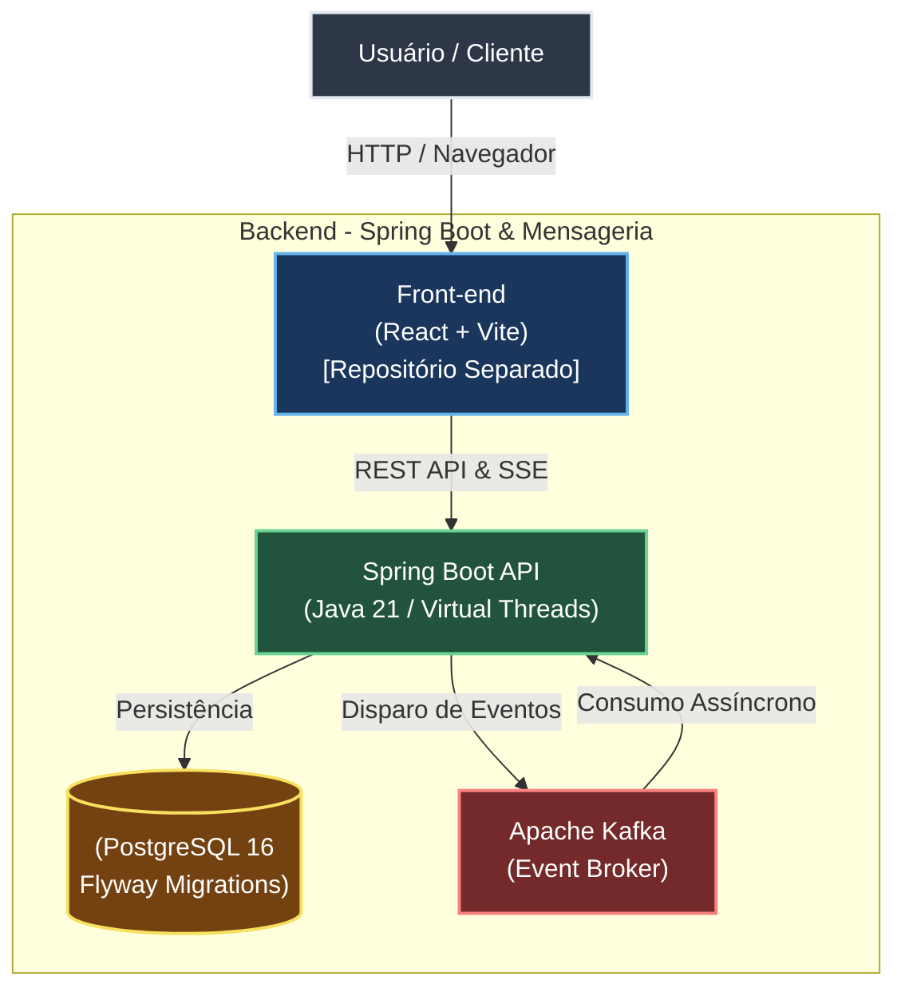

[](https://www.oracle.com/java/)
[](https://spring.io/projects/spring-boot)
[](https://maven.apache.org/)
[](https://www.postgresql.org/)
[](https://documentation.red-gate.com/flyway)
[](https://kafka.apache.org/)
[](https://www.docker.com/)
[](https://junit.org/)
[](https://site.mockito.org/)
[](https://jestjs.io/)
[](https://github.com/ladjs/supertest)
[](https://github.com/features/actions)

# FitStream API — Real-Time Fitness & Nutrition

Backend do ecossistema FitStream, responsável pelo gerenciamento de treinos,
nutrição, regras de negócio, persistência de dados e processamento de eventos
em tempo real.

Desenvolvido com Java 21 e Spring Boot, o projeto utiliza uma arquitetura
modular, processamento assíncrono com Apache Kafka e Server-Sent Events (SSE)
para comunicação em tempo real com o frontend.

> Frontend: [FitStream App](https://github.com/LeonardoEnnes/fitstream-app)

## Sobre o Projeto

O FitStream é uma aplicação voltada ao acompanhamento de treinos e nutrição,
permitindo registrar e acompanhar métricas como exercícios, cargas, calorias
e macronutrientes.

O backend centraliza as regras de negócio e disponibiliza uma API REST,
além de mecanismos de atualização em tempo real para o frontend.

## Principais Funcionalidades

- Gerenciamento de treinos e exercícios
- Registro e acompanhamento de cargas
- Controle de calorias e macronutrientes
- Atualização de dados em tempo real via SSE
- Processamento assíncrono de eventos com Apache Kafka
- Persistência em PostgreSQL
- Versionamento do schema com Flyway
- Testes unitários, integração e funcionais
- Pipeline de integração contínua com GitHub Actions

## Tecnologias

| Categoria | Tecnologia |
|---|---|
| Linguagem | Java 21 |
| Framework | Spring Boot |
| Build | Maven |
| Banco de dados | PostgreSQL 16 |
| Migrations | Flyway |
| Mensageria | Apache Kafka |
| Comunicação em tempo real | Server-Sent Events (SSE) |
| Containerização | Docker |
| Testes unitários | JUnit, Mockito |
| Testes de integração | Spring Boot Test |
| Testes funcionais | Jest, Supertest |
| Testes funcionais | Node.js, pnpm |
| CI | GitHub Actions |

## Arquitetura



### Como Executar o Projeto Localmente

#### 1. Subir o Docker

Na raiz do projeto, execute:

```bash
docker compose up -d --build
```

#### 2. Verificar se a API está respondendo
```bash
http://localhost:8080/
```
Ou acesse a documentação Swagger através do navegador:
````
http://localhost:8080/swagger-ui.html
````
### Testes Unitários e de Integração
Para executar os testes unitários e de integração:
````
./mvnw clean verify
````
#### Testes Funcionais
Os testes funcionais utilizam Jest + Supertest e são executados de maneira independente através do Node

Acesse a pasta de testes:
````
cd __functionalTest
pnpm install
pnpm test
````
